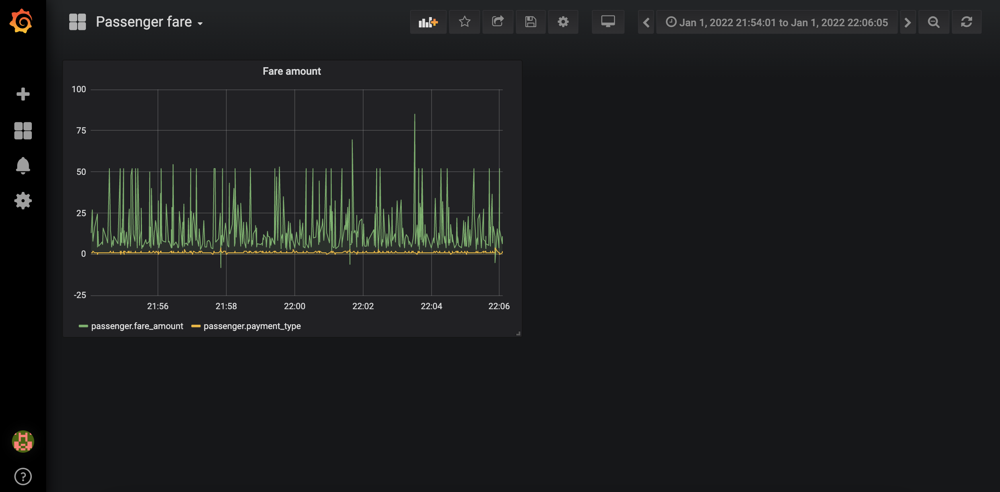

# InfluxDB + Grafana on GCP Kubernetes (GKE) with sample data and visualization in Grafana

## Deploy to GKE

Navigate to the [Google Kubernetes Engine](https://console.cloud.google.com/kubernetes/list) section of the web console and wait for the system to initialize.  
Then, start a console and run the following commands:

```sh
# Set defaults for the gcloud command-line tool
export ZONE=<zone> # e.g. europe-west1-b see https://cloud.google.com/compute/docs/regions-zones/#available
export PROJECT_ID=<project-id>
gcloud config set project $PROJECT_ID
gcloud config set compute/zone $ZONE

# Create a GKE cluster with one n1-standard-1 node:
gcloud container clusters create influxdb-grafana \
                --num-nodes 1 \
                --machine-type n1-standard-1 \
                --zone $ZONE
```

Output:
```
NAME              LOCATION        MASTER_VERSION  MASTER_IP     MACHINE_TYPE   NODE_VERSION    NUM_NODES  STATUS
influxdb-grafana  europe-west1-b  1.22.8-gke.202  <MASTER_IP>   n1-standard-1  1.22.8-gke.202  1          RUNNING
```

```sh
## Create a secret to store InfluxDB and Grafana auth information
kubectl create secret generic influxdb-grafana \
  --from-literal=influxdb-user=admin \
  --from-literal=influxdb-password=passw0rd \
  --from-literal=grafana-user=admin \
  --from-literal=grafana-password=passw0rd

# Deploy InfluxDB to GKE
kubectl create -f influxdb-k8s/

# Deploy Grafana to GKE
kubectl create -f grafana-k8s/

# See the services external IPs / ports
kubectl get services
```

Output:
```
NAME         TYPE           CLUSTER-IP    EXTERNAL-IP     PORT(S)          AGE
grafana      LoadBalancer   10.96.8.156   <GRAFANA_IP>    3000:31678/TCP   90s
influxdb     LoadBalancer   10.96.13.52   <INFLUXDB_IP>   8086:30565/TCP   90s
kubernetes   ClusterIP      10.96.0.1     <none>          443/TCP          6m2s
```

Then, go to `http://<grafana service external ip>:3000` and add an InfluxDB data source:  
* URL: http://influxdb:8086
* Database: exercise

```sh
# See the k8s pods
kubectl get pods
```

Output:
```
NAME                       READY   STATUS    RESTARTS   AGE
grafana-6b8bf8f9fc-drccr   1/1     Running   0          13m
influxdb-9557fc585-9mhdz   1/1     Running   0          13m
```

```sh
# Access the Influxdb on command line
kubectl exec -it influxdb-9557fc585-9mhdz -- /bin/bash

# Login to influxdb
influx --username admin --password passw0rd
```

Output:
```
bash-4.4# influx --username admin --password passw0rd
Connected to http://localhost:8086 version 1.7.4
InfluxDB shell version: 1.7.4
Enter an InfluxQL query
> show databases
name: databases
name
----
exercise
_internal
>
```

## Insert sample data into InfluxDB

Data source: [January 2022 - New York Yellow Taxi Trip Records](https://www1.nyc.gov/site/tlc/about/tlc-trip-record-data.page)

Influxdb design guidance: [InfluxDB Schema design](https://cs.ulb.ac.be/public/_media/teaching/influxdb_2017.pdf)

```sh
python sample-data/parquet-to-influxdb-all.py sample-data/yellow_tripdata_2022-01.parquet <influxdb service external ip> exercise passenger
```

The command can take 5-10 minutes to complete for inserting all the data into influxdb. You can connect to influxdb on command line and check for tag keys of measurement "passenger"

Output:
```
bash-4.4# influx --username admin --password passw0rd
Connected to http://localhost:8086 version 1.7.4
InfluxDB shell version: 1.7.4
Enter an InfluxQL query
> use exercise
Using database exercise
> show measurements
name: measurements
name
----
passenger
> show tag keys
name: passenger
tagKey
------
VendorID
RatecodeID
payment_type
>
```

## Simple Grafana Dashboard to show Fare Amount and Payment Type

Visit the Grafana UI and Create a new dashboard of type Graph and edit panel to give a suitable name and add the following query.

```sh
SELECT "fare_amount", "payment_type" FROM "passenger" WHERE $timeFilter
```

Select a time range from 01 January 2022 to 02 January 2022 to see a sample visualization.




## Cleaning up

If you want to delete everything, run the following:

```sh
# Delete influxdb k8s services, deployments, persistent volumes
kubectl delete -f influxdb-k8s/
# Delete grafana k8s services, deployments, persistent volumes
kubectl delete -f grafana-k8s/

# Delete the secret
kubectl delete secret influxdb-grafana

# Delete the GKE cluster
gcloud container clusters delete influxdb-grafana

# Delete compute engine disks
gcloud compute disks list
gcloud compute disks delete <disk-name>

# Delete load balancing services
open https://console.cloud.google.com/net-services/loadbalancing/loadBalancers/list
```
